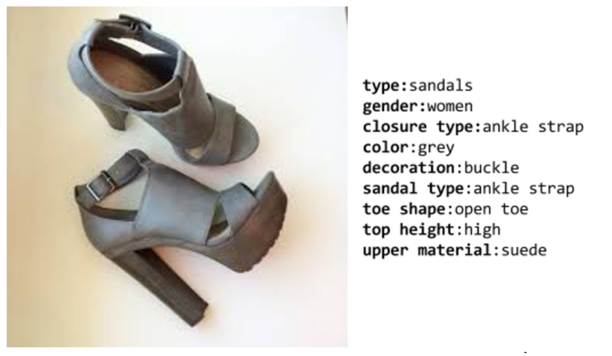

<!--  -->

# iMaterialist Competition 
Please open an issue if you have questions or problems with the dataset.

# 2017 Competition
The 2017 competition, sponsored by Google, is part of the [FGVC^4 workshop](http://fgvc.org) at [CVPR](http://cvpr2017.thecvf.com/). 

## Dates
|||
|------|---------------|
Data Released|April 5, 2017|
Submission Server Open |June 2017|
Submission Deadline|June 30, 2017|
Winners Announced|July 21, 2017|

## Details
iMaterialist is a fine-grained attribute recognition challenge for product images. With the growing popularity of online shopping, being able to recognize products from pictures is an important but challenging problem. The recognition is challenging because, for the same product, a picture can be taken under different lighting and viewing angle, various backgrounds, and different level of occlusion.  One central piece for recognizing a product is to understand and obtain the attributes information of a product. In this competition, FGVC workshop organizers and Google invite the Kaggle community to join efforts in advancing technologies for fine-grained attribute recognition for products.

The attributes describes properties of a product. For example, in the figure below, the pair of shoes have the attributes described on the right:

In this competition, you are challenged to develop recognition / classification algorithms which accurately assign attribute labels for apparel items in the image dataset.  The training dataset includes images from four apparel classes (outerwear, dresses, pants, shoes), with [TBA] attribute label for each image. It includes a total of [TBA] attribute labels. By participating in this competition, you will contribute to the state-of-the-art computer vision and machine research and setting benchmarks for fine-grained attribute product recognition.

## Evaluation
TBA

## Guidelines
TBA

## Annotation Format
TBA

## Submission Format
TBA

## Terms of Use
TBA

## Data
TBA