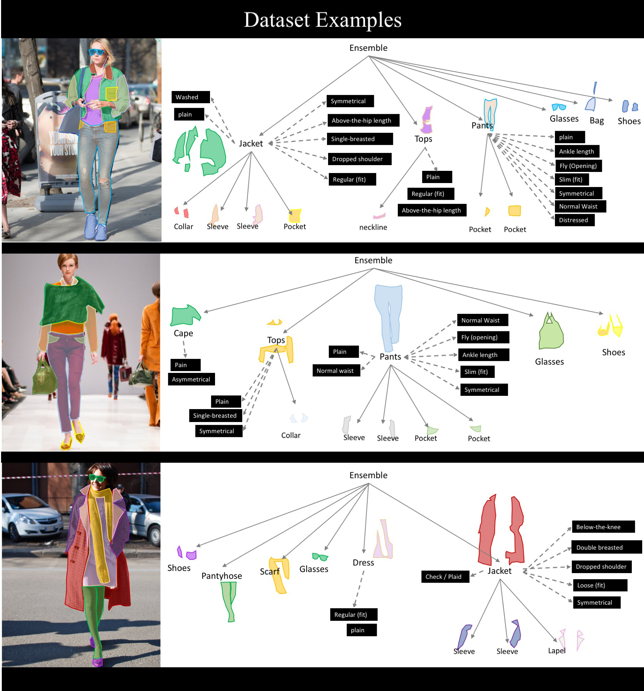

# iMaterialist Competition - Fashion

# 2019 Competition
The 2019 competition, sponsored by Google, is part of the [FGVC6 workshop](https://sites.google.com/view/fgvc6/home) at [CVPR](http://cvpr2019.thecvf.com/). 

Please open an issue if you have questions or problems with the dataset.


## Kaggle
We are using Kaggle to host the leaderboard. Checkout the competition page [here](https://www.kaggle.com/c/imaterialist-fashion-2019-FGVC6).


## Dates
| Task | Date |
|----|---------------|
|Entry deadline| **June 3, 2019** |
|Team Merger deadline | **June 3, 2019** |
|Final submission deadline| **June 10, 2019**|


## Details

Visual analysis of clothing is a topic that has received increasing attention in recent years. Being able to recognize apparel products and associated attributes from pictures could enhance shopping experience for consumers, and increase work efficiency for fashion professionals.

We present a new clothing dataset with the goal of introducing **a novel fine-grained segmentation task** by joining forces between the fashion and computer vision communities. The proposed task unifies both categorization and segmentation of rich and complete apparel attributes, an important step toward real-world applications. 



While early work in computer vision addressed related clothing recognition tasks, these are not designed with fashion insiders’ needs in mind, possibly due to the research gap in fashion design and computer vision. To address this, we first propose a fashion taxonomy built by fashion experts, informed by product description from the internet. To capture the complex structure of fashion objects and ambiguity in descriptions obtained from crawling the web, our standardized taxonomy contains **46** apparel objects (**27** main apparel items and **19** apparel parts), and **92** related fine-grained attributes. Secondly, a total of around 50K clothing images (10K with both segmentation and fine-grained attributes, 40K with apparel instance segmentation) in daily-life, celebrity events, and online shopping are labeled by both domain experts and crowd workers for fine-grained segmentation.

In this competition, we challenge you to develop algorithms that will help with an important step towards automatic product detection – to accurately assign segmentations and attribute labels for fashion images. Individuals/Teams with top submissions will be invited to present their work live at the FGVC6 workshop.

For more information on the Evaluation Metric, Data / Submission Format, Rules and participating the iMaterialist Competition, please see the [Kaggle challenge page](https://www.kaggle.com/c/imaterialist-fashion-2019-FGVC6).


## Details

Apparel instance segmentations include 27 main apparel objects  (jackets, dresses, skirts, etc) and 19 apparel parts (sleeves, collars, etc). A total of 92 fine-grained attributes was annotated by expert for main apparel objects. 


## Annotation Format

Our annotations are in csv format. Please refer to our [Kaggle page](https://www.kaggle.com/c/imaterialist-fashion-2019-FGVC6/overview/evaluation) for annotation details.

We will also provide an alternativel annotation format soon, following the annotation format of the [COCO dataset](http://mscoco.org/dataset/#download) with additonal fields, such as attributes. The annotations are stored in the [JSON format](http://www.json.org/) and are organized as follows: 

```
{
 "info": info,
 "categories": [category],
 "attributes": [attribute],
 "images": [image],
 "annotations": [annotation],
 "licenses": [license]
}

info{
  "year" : int,
  "version" : str,
  "description" : str,
  "contributor" : str,
  "url" : str,
  "date_created" : datetime,
}

category{
  "id" : int,
  "name" : str,
  "supercategory" : str,  # parent of this label
  "level": int,           # levels in the taxonomy
  "taxonomy_id": string,
}

attribute{
  "id" : int,
  "name" : str,
  "supercategory" : str,  # parent of this label
  "level": int,           # levels in the taxonomy
  "taxonomy_id": string,
}

image{
  "id" : int,
  "kaggle_id": str,
  "width" : int,
  "height" : int,
  "file_name" : str,
  "license" : int,
  "time_captured": string,
  "original_url": string,
  "isstatic": int, 0: the original_url is not a static url
}

annotation{
  "id" : int,
  "image_id" : int,
  "category_id" : int,
  "attribute_ids": [int],
  "segmentation" : [polygon] or [rle]
  "bbox" : [x,y,width,height], # int
  "area" : int
  "iscrowd": int (1 or 0)
}
polygon: [x1, y1, x2, y2, ...], where x, y are the coordinates of vertices, int
rle: {"size", (height, widht), "counts": str}

license{
  "id" : int,
  "name" : str,
  "url" : str
}
```


## Download

CSV: please refer to our [kaggle site](<https://www.kaggle.com/c/imaterialist-fashion-2019-FGVC6/data>).

JSON format: coming soon!


## Differences from iMat Fashion 2018

Whereas iMat-Fashion-2018 covered fine-grained attributes classification, this year our competition introduces a novel task, which is to jointly learn apparel instance segmentation with fine-grained attributes classification. Our 2019 dataset also propose a fashion taxonomy built by fashion experts, with total 138 apparel categories and attributes. 

For more details on iMat Fashion 2018, please see [this page](https://www.kaggle.com/c/imaterialist-challenge-fashion-2018).


## Acknowledgements

The iMat-Fashion Challenge 2019 is sponsored by Google AI, CVDF, Samasource and [Fashionpedia](https://fashionpedia.github.io/home/index.html).

